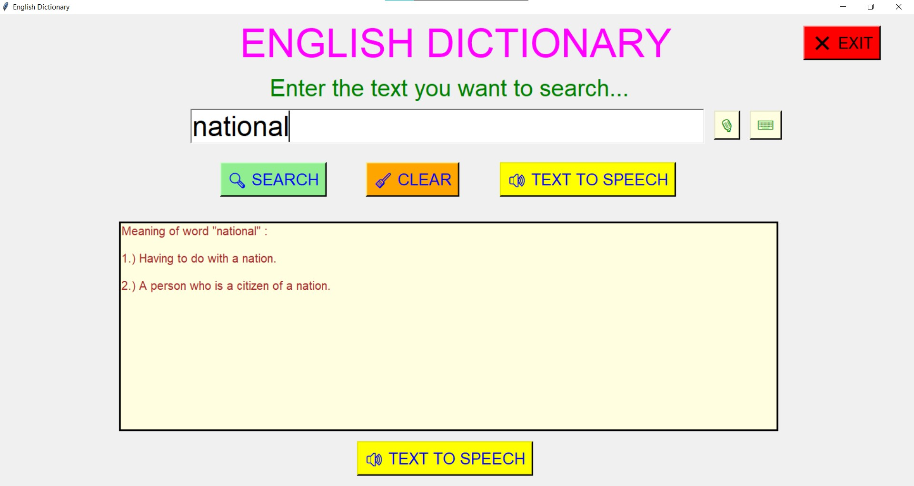
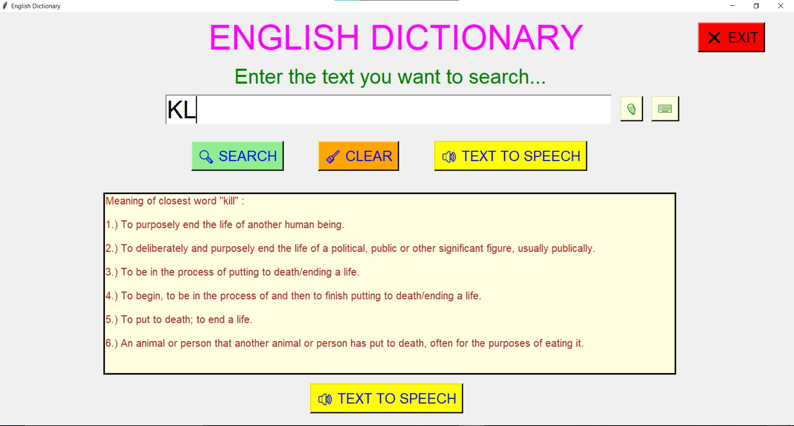

# ✔ Dictionary
- ### A dictionary created using json data file and tkinter GUI.
- ### Used data.json file and used those data importing json library.
- ### Also modified the code for case of interface (word having multiple meaning) ans also developed the closest word matching in case of any typo.

****

   
   
   
   
   
   

